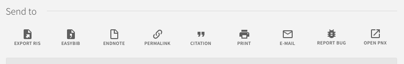

# primo-explore-custom-actions

[](https://www.npmjs.com/package/primo-explore-custom-actions)

## Features
Custom links can be added to the actions menu visible on Primo brief results and full display. Links can extract properties of the item's PNX record and apply them to the link URL.

### Screenshot


## Install
1. Make sure you've installed and configured [primo-explore-devenv](https://github.com/ExLibrisGroup/primo-explore-devenv).
2. Navigate to your template/central package root directory. For example:
    ```
    cd primo-explore/custom/MY_VIEW_ID
    ```
3. If you do not already have a `package.json` file in this directory, create one:
    ```
    npm init -y
    ```
4. Install this package:
    ```
    npm install primo-explore-custom-actions --save
    ```
Alternatively, just copy the contents of `dist/module.js` into your `custom.js` file.

## Usage
Once this package is installed, add `customActions` as a dependency for your custom module definition.

```js
var app = angular.module('viewCustom', ['customActions'])
```
Note: If you're using the `--browserify` build option, you will need to first import the module with:

```javascript
import 'primo-explore-custom-actions';
```

You can add new actions by adding `<custom-action>` elements to the template of `prmActionListAfter`. Each element needs the properties below:

| name | type | usage |
|---|---|---|
| `name` | string | a short, unique name for the action. don't include whitespace characters. |
| `label` | string | the name that will display on the action button. whitespace ok. |
| `index` | integer | where to insert the action. 0 would be "first", 1 would be "second", etc.|
| `icon` | string | the icon on the button. must be chosen from <https://material.io/icons/>. should be in the form "ic_icon_name_with_underscores_24px". some icons may not display. |
| `icon-set` | string | the set of icons from which the above icon is drawn.|
| `link` | string | URL to open when the action is clicked. supports templating (see below). |

### Templating

You can create interpolation expressions using `{ }` in the link text and they will be replaced with corresponding values taken from the item - for example, `{pnx.search.recordid[0]}` would become the recordID of the item, taken from the pnx.

### Example

The example below will generate a configuration similar to that visible in the screenshot above. It adds a "report problem" link that will navigate to the institution's "report problem" form and append the record ID as a GET parameter, and a link that will open the given record's PNX for viewing.

```js
var app = angular.module('viewCustom', ['customActions'])

app.component('prmActionListAfter', {
  template: `<custom-action name="open_pnx"
                            label="Open PNX"
                            index=8
                            icon="ic_find_in_page_24px"
                            icon-set="action"
                            link="/primo_library/libweb/jqp/record/{pnx.search.recordid[0]}.pnx" />
            <custom-action  name="report_bug"
                            label="Report Bug"
                            index=7
                            icon="ic_bug_report_24px"
                            icon-set="action"
                            link="http://my.institution.edu/report_problem?record_id={pnx.search.recordid[0]}" />`
})
```

<!-- ## Running tests
1. Clone the repo
2. Run `npm install`
3. Run `npm test` -->

[More detailed documentation is available here](https://docs.google.com/document/d/1gTehnrMMS66tnhfkWbGiGG4fbsNTrZOtOzf5EzVjdOU/edit) on how to link to a specific Primo Record in various reporting systems such as Google Docs, Survey Monkey, and Qualitrics.
